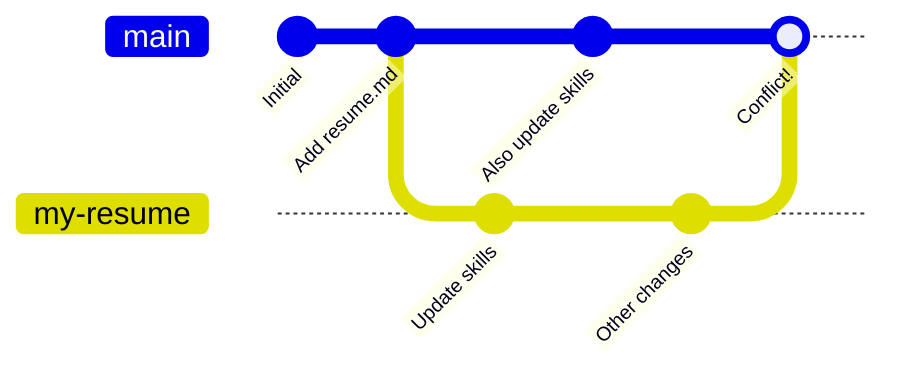

## Step 1: Learn about merge conflicts

### What is a merge conflict?

A **merge conflict** occurs when changes are made to the same part of the same file on two different branches.

**What's happening here:**

1. We start with a repository and add a `resume.md` file.
2. We create a new branch called `my-resume` and update the skills area.
3. At the same time, someone else also updates the skills area on the `main` branch.
4. We add other unrelated changes to the `my-resume` branch.
5. When we try to merge `my-resume` into `main`, we get a **conflict!** Both branches modified the same part of `resume.md`.

### ⌨️ Activity: Create a pull request

To quickly practice, we already created the above scenario for you by making a new branch `my-resume` then modifying `resume.md` on both branches, which will will cause a conflict. Let's practice with it!

1. Open this repo in a new browser tab, and work on the steps in your second tab while you read the instructions in this tab.

1. In the top navigation, select the **Pull requests** tab.

1. Click the **New pull request** button and use the following settings:

   - Base: `main`
   - Compare: `my-resume`
   - Title: `Resolve a merge conflict`

1. With the new pull request opened, Mona will share the next steps.
