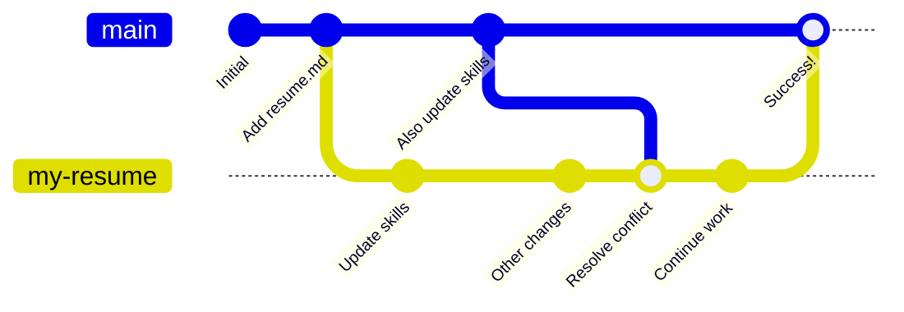

## Step 2: Resolve a merge conflict

Managing conflicts can be intimidating, but have no fear, Git is smart with merging! Git only needs a human to decide when the situation is very unclear.

You typically have 3 options for managing a conflict:

1. Accept the version from the base branch.
1. Accept the version from the compare branch.
1. Manually combined the changes from both branches.

> [!TIP]
> You can learn more about managing conflicts on the [GitHub Docs: resolve the conflict](https://docs.github.com/en/pull-requests/collaborating-with-pull-requests/addressing-merge-conflicts/resolving-a-merge-conflict-using-the-command-line) page.

### When should I resolve a conflict?

Conflicts can be resolved as soon as they are noticed. Resolving a conflict doesn't automatically merge the pull request in GitHub. Instead, it stores the conflict's resolution as a **reverse merge** commit, allowing you to keep working on your branch as normal.

This means that some changes from the `base` branch (`main`) are merged into the `compare` branch (`my-resume`). Only the `compare` branch is updated, which allows you to test the resolved changes before merging.



### ⌨️ Activity: Resolve a merge conflict

1. If needed, open the recently created pull request.

1. Scroll to the bottom of the page. Near the merge button, notice a message indicating there are conflicts to be resolved.

1. Press the **Resolve conflicts** button to open a special text editor for handling merge conflicts.

1. Look for a highlighted section similar to the below, which shows both versions of the conflict.

   ```txt
   <<<<<<< my-resume
   - Contributed to open source projects
   =======
   - Built internal tools
   >>>>>>> main
   ```

1. After some inspection, we decide to keep the version from the compare branch. Remove the base branch version by deleting then content between `=======` and `>>>>>>> main`.

   ```txt
   <<<<<<< my-resume
   - Contributed to open source projects
   =======
   >>>>>>> main
   ```

1. With our manual changes finished, let's remove the merge conflict markers. Only the content from the compare branch will remain.

   ```txt
   - Contributed to open source projects
   ```

1. In the top right, click the **Mark as resolved** button and choose **Commit merge**.

1. With the conflict resolved, Mona will share the next steps.
